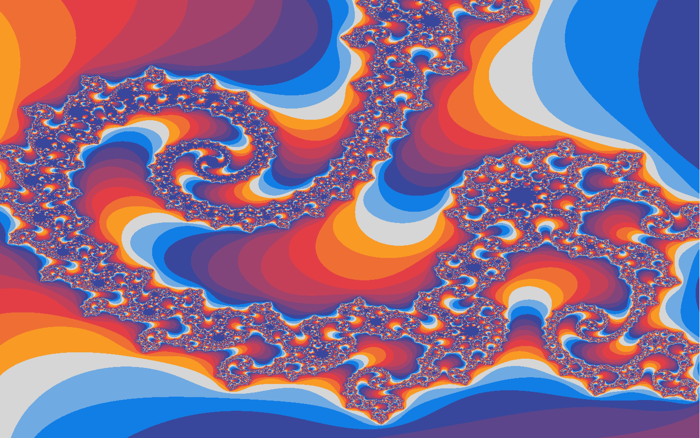

[![Contributors][contributors-shield]][contributors-url]
[![Forks][forks-shield]][forks-url]
[![Stargazers][stars-shield]][stars-url]
[![Issues][issues-shield]][issues-url]
[![MIT License][license-shield]][license-url]

<!-- PROJECT LOGO -->
 

  <h3 align="center">PPM-Fractal</h3>

  

    An awesome CLI and GUI app to visualize fractals!
     
    <a href="https://github.com/kolbyrogers/ppm-fractal/issues">Report Bug</a>
    ·
    <a href="https://github.com/kolbyrogers/ppm-fractal/issues">Request Feature</a>
  

<!-- TABLE OF CONTENTS -->

  
Table of Contents

  <ol>
    <li>
      <a href="#about-the-project">About The Project</a>
      <ul>
        <li><a href="#built-with">Built With</a></li>
      </ul>
    </li>
    <li><a href="#contributing">Contributing</a></li>
    <li><a href="#license">License</a></li>
  </ol>

<!-- ABOUT THE PROJECT -->

## About The Project

This CLI and GUI app allows users to create PPM images, apply image filters, and visualize fractals!

Project features:

- Multithreading
- Anti-aliasing

(<a href="#top">back to top</a>)

### Built With

- C++
- OpenGL

(<a href="#top">back to top</a>)

<!-- CONTRIBUTING -->

## Contributing

Contributions are what make the open source community such an amazing place to learn, inspire, and create. Any contributions you make are **greatly appreciated**.

If you have a suggestion that would make this better, please fork the repo and create a pull request. You can also simply open an issue with the tag "enhancement".
Don't forget to give the project a star! Thanks again!

1. Fork the Project
2. Create your Feature Branch (`git checkout -b feature/AmazingFeature`)
3. Commit your Changes (`git commit -m 'Add some AmazingFeature'`)
4. Push to the Branch (`git push origin feature/AmazingFeature`)
5. Open a Pull Request

(<a href="#top">back to top</a>)

<!-- LICENSE -->

## License

Distributed under the MIT License. See `LICENSE.txt` for more information.

(<a href="#top">back to top</a>)

<!-- MARKDOWN LINKS & IMAGES -->
<!-- https://www.markdownguide.org/basic-syntax/#reference-style-links -->

[contributors-shield]: https://img.shields.io/github/contributors/kolbyrogers/ppm-fractal.svg?style=for-the-badge
[contributors-url]: https://github.com/kolbyrogers/ppm-fractal/graphs/contributors
[forks-shield]: https://img.shields.io/github/forks/kolbyrogers/ppm-fractal.svg?style=for-the-badge
[forks-url]: https://github.com/kolbyrogers/ppm-fractal/network/members
[stars-shield]: https://img.shields.io/github/stars/kolbyrogers/ppm-fractal.svg?style=for-the-badge
[stars-url]: https://github.com/kolbyrogers/ppm-fractal/stargazers
[issues-shield]: https://img.shields.io/github/issues/kolbyrogers/ppm-fractal.svg?style=for-the-badge
[issues-url]: https://github.com/kolbyrogers/ppm-fractal/issues
[license-shield]: https://img.shields.io/github/license/kolbyrogers/ppm-fractal.svg?style=for-the-badge
[license-url]: https://github.com/kolbyrogers/ppm-fractal/blob/master/LICENSE.txt
